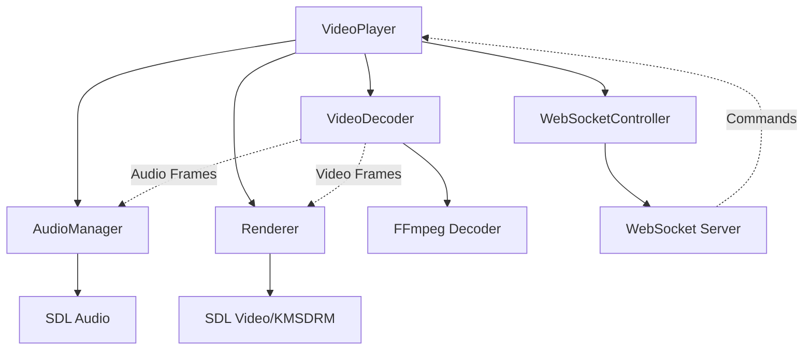
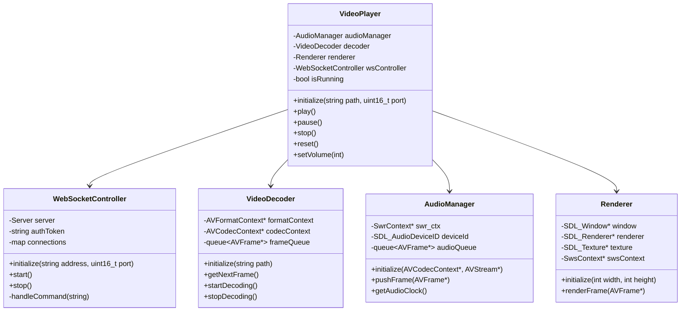

# 4K Video Player for Raspberry Pi 5

A high-performance video player optimized for Raspberry Pi 5, capable of playing 4K videos with audio/video synchronization and WebSocket control.

Perfect for permanent installations on Raspberry Pi 5 (video mapping, digital signage, interactive displays)

<div align="center">

[](https://github.com/your-username/rpi5-4k-player/stargazers)
[](https://github.com/your-username/rpi5-4k-player/network/members)
[](https://github.com/your-username/rpi5-4k-player/issues)
[](https://github.com/your-username/rpi5-4k-player/blob/main/LICENSE)

</div>

## 🚀 Features

- 4K video playback with hardware acceleration via KMSDRM
- Precise audio/video synchronization (±10ms)
- Optimized multi-threaded decoding
- Supported codecs:
  - H.264/AVC
  - H.265/HEVC
  - AAC (audio)
- Smart audio/video buffer management
- Integrated logging system
- Automatic video looping
- Clean signal handling (Ctrl+C)
- Remote control via WebSocket

// ... Garder les diagrammes Mermaid inchangés ... //

## 🎮 WebSocket Control

Remote control via WebSocket (default port 9002). Available commands:

```json
{"token": "your_token", "command": "play"}
{"token": "your_token", "command": "pause"}
{"token": "your_token", "command": "stop"}
{"token": "your_token", "command": "reset"}
{"token": "your_token", "command": "volume", "value": 50}
```

Authentication token is generated at startup and displayed in logs.

## 📋 Requirements

### Hardware
- Raspberry Pi 5
- Minimum 4GB RAM (8GB recommended for 4K)
- HDMI 2.0 compatible display for 4K

### Dependencies
```bash
sudo apt-get update
sudo apt-get install -y \
    build-essential \
    cmake \
    libsdl2-dev \
    libavcodec-dev \
    libavformat-dev \
    libavutil-dev \
    libswscale-dev \
    libswresample-dev \
    libavfilter-dev
```

## 🛠️ Build

```bash
mkdir build
cd build
cmake ..
make -j4
```

## 📦 Usage

```bash
./video_player path/to/video.mp4
```

## 🚀 Performance

- 4K H.264 decoding: up to 60 FPS
- Audio latency < 50ms
- CPU usage: ~40% on RPi 5
- RAM usage: ~200MB for 4K
- A/V sync: ±10ms

## 🤝 Contributing

Contributions are welcome! Here are some priority areas for improvement:

1. Additional RPi 5 optimizations
2. Support for more codec formats
3. UI improvements
4. Documentation translations

Please read our [Contributing Guidelines](CONTRIBUTING.md) before submitting a PR.

## 📊 Benchmarks

<details>
<summary>View detailed performance metrics</summary>

| Resolution | Codec  | FPS | CPU Usage | RAM Usage |
|------------|--------|-----|-----------|-----------|
| 4K (2160p) | H.264  | 60  | 40%      | 200MB     |
| 4K (2160p) | H.265  | 60  | 35%      | 180MB     |
| 1080p      | H.264  | 60  | 15%      | 100MB     |
| 1080p      | H.265  | 60  | 12%      | 90MB      |

</details>

## 🏗️ Architecture



## 📊 Class Diagram




## 📝 License

This project is licensed under the MIT License - see the [LICENSE](LICENSE) file for details.

## 🌟 Show your support

Give a ⭐️ if this project helped you!

---

<div align="center">
Made with ❤️ for the Raspberry Pi community
</div>


