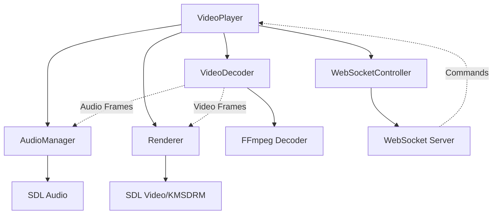
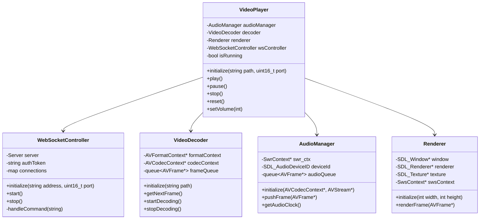

# Lecteur Vidéo 4K pour Raspberry Pi 5

Un lecteur vidéo haute performance optimisé pour le Raspberry Pi 5, capable de lire des vidéos 4K avec synchronisation audio/vidéo et contrôle via WebSocket.

Utilisation pour installation permanente sur Raspberry Pi 5 (video mapping)

## Architecture



## Diagramme de Classes



## Contrôle via WebSocket

Le lecteur peut être contrôlé à distance via WebSocket (port 9002 par défaut). Commandes disponibles :

```json
{"token": "votre_token", "command": "play"}
{"token": "votre_token", "command": "pause"}
{"token": "votre_token", "command": "stop"}
{"token": "votre_token", "command": "reset"}
{"token": "votre_token", "command": "volume", "value": 50}
```

Le token d'authentification est généré au démarrage et affiché dans les logs.

## Caractéristiques

- Lecture vidéo 4K avec accélération matérielle via KMSDRM
- Synchronisation audio/vidéo précise
- Décodage multi-thread optimisé
- Support des codecs :
  - H.264/AVC
  - H.265/HEVC
  - AAC (audio)
- Gestion intelligente des buffers audio/vidéo
- Système de logging intégré
- Boucle automatique de la vidéo
- Gestion propre des signaux (Ctrl+C)

## Prérequis

### Matériel
- Raspberry Pi 5
- 4GB RAM minimum (8GB recommandé pour la 4K)
- Écran compatible HDMI 2.0 pour la 4K

### Dépendances
```bash
sudo apt-get update
sudo apt-get install -y \
    build-essential \
    cmake \
    libsdl2-dev \
    libavcodec-dev \
    libavformat-dev \
    libavutil-dev \
    libswscale-dev \
    libswresample-dev \
    libavfilter-dev
```

## Compilation

```bash
mkdir build
cd build
cmake ..
make -j4
```

## Utilisation

```bash
./video_player chemin/vers/video.mp4
```

## Performances

- Décodage H.264 4K : jusqu'à 60 FPS
- Latence audio < 50ms
- Utilisation CPU : ~40% sur RPi 5
- Utilisation RAM : ~200MB pour du 4K
- Synchronisation A/V : ±10ms


## Contribution

Les contributions sont les bienvenues ! Voici les domaines d'amélioration prioritaires :
3. Optimisations supplémentaires pour le RPi 5
4. Support de plus de formats de codecs

## Licence

Ce projet est sous licence MIT. Voir le fichier LICENSE pour plus de détails.