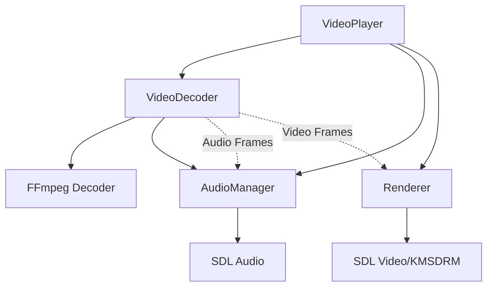
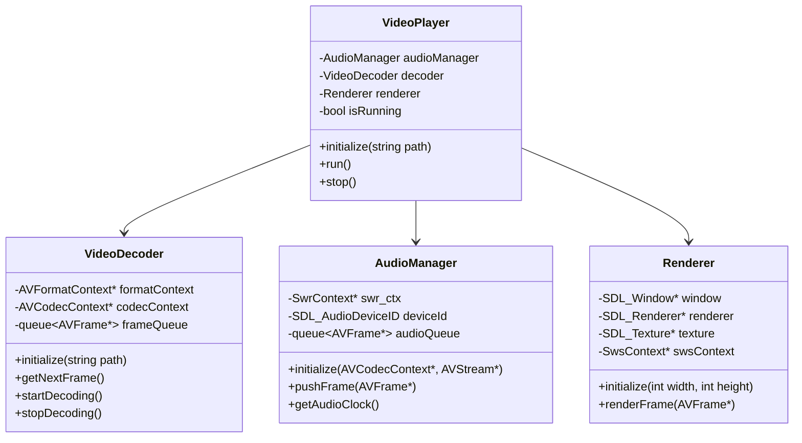

# Lecteur Vidéo 4K pour Raspberry Pi 5

Un lecteur vidéo haute performance optimisé pour le Raspberry Pi 5, capable de lire des vidéos 4K avec synchronisation audio/vidéo et contrôle via WebSocket.

Utilisation pour installation permanente sur Raspberry Pi 5 (video mapping)
## Architecture



## Structure du Projet
```
src/
├── core/
│   ├── AudioManager.cpp     # Gestion audio et synchronisation
│   ├── AudioManager.h
│   ├── VideoDecoder.cpp     # Décodage vidéo et audio
│   ├── VideoDecoder.h
│   ├── Renderer.cpp         # Rendu vidéo avec SDL/KMSDRM
│   └── Renderer.h
├── utils/
│   ├── Logger.cpp           # Système de logging
│   └── Logger.h
├── VideoPlayer.cpp          # Classe principale
├── VideoPlayer.h
└── main.cpp
```

## Caractéristiques

- Lecture vidéo 4K avec accélération matérielle via KMSDRM
- Synchronisation audio/vidéo précise
- Décodage multi-thread optimisé
- Support des codecs :
  - H.264/AVC
  - H.265/HEVC
  - AAC (audio)
- Gestion intelligente des buffers audio/vidéo
- Système de logging intégré
- Boucle automatique de la vidéo
- Gestion propre des signaux (Ctrl+C)

## Prérequis

### Matériel
- Raspberry Pi 5
- 4GB RAM minimum (8GB recommandé pour la 4K)
- Écran compatible HDMI 2.0 pour la 4K

### Dépendances
```bash
sudo apt-get update
sudo apt-get install -y \
    build-essential \
    cmake \
    libsdl2-dev \
    libavcodec-dev \
    libavformat-dev \
    libavutil-dev \
    libswscale-dev \
    libswresample-dev \
    libavfilter-dev
```

## Compilation

```bash
mkdir build
cd build
cmake ..
make -j4
```

## Utilisation

```bash
./video_player chemin/vers/video.mp4
```

## Performances

- Décodage H.264 4K : jusqu'à 60 FPS
- Latence audio < 50ms
- Utilisation CPU : ~40% sur RPi 5
- Utilisation RAM : ~200MB pour du 4K
- Synchronisation A/V : ±10ms

## Diagramme de Classes



## Limitations Connues
- Pas de contrôle de lecture (pause, seek)
- Pas de support des sous-titres
- Pas d'interface graphique de contrôle

## Contribution

Les contributions sont les bienvenues ! Voici les domaines d'amélioration prioritaires :
1. Support des sous-titres
2. Interface de contrôle (pause, seek, volume)
3. Optimisations supplémentaires pour le RPi 5
4. Support de plus de formats de codecs
5. Interface graphique minimaliste

## Licence

Ce projet est sous licence MIT. Voir le fichier LICENSE pour plus de détails.